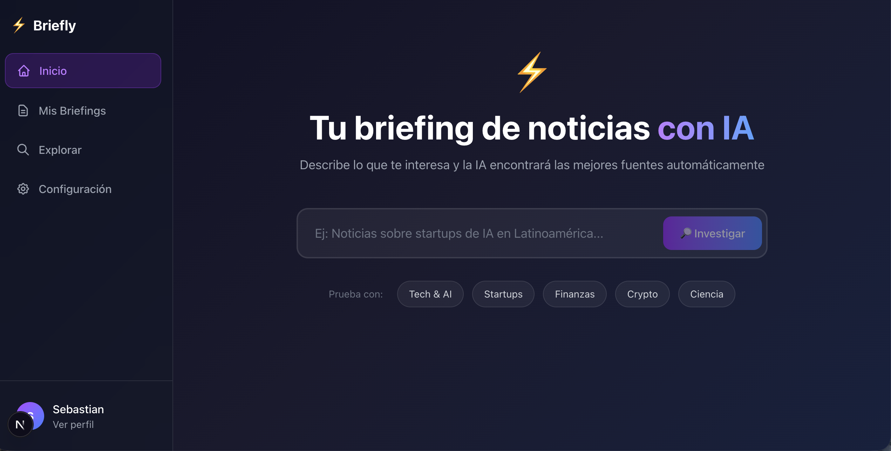

# Briefly 📰⚡

> AI-powered personalized news briefings using natural language

**Briefly** te permite crear briefings de noticias personalizados describiendo en lenguaje natural qué temas te interesan. El Research Agent de IA investiga, encuentra fuentes relevantes, scrapea artículos y los presenta en un formato limpio y moderno.



---

## 🏗️ Arquitectura

```
briefly/
├── backend/          # FastAPI + Strands + Claude SDK
├── frontend/         # Next.js 14 + TypeScript + Tailwind
├── infra/            # AWS CDK (Python)
└── docs/             # Documentación técnica
```

### Tech Stack

| Componente | Tecnología |
|------------|-----------|
| **Backend** | FastAPI, Python 3.11+, SQLModel |
| **AI/LLM** | Strands Agents, Claude SDK, **Gemini API** |
| **Search** | **Tavily API**, Google Custom Search, Web Scraping Fallback |
| **DB Relacional** | PostgreSQL (Source of Truth) |
| **DB NoSQL** | DynamoDB (Article Cache & Fast Reads) |
| **Frontend** | Next.js 14, TypeScript, Tailwind CSS, shadcn/ui |
| **CI/CD** | GitHub Actions (Tests, Linting, Mypy) |
| **Code Review** | **Custom AI Reviewer** (Gemini 2.0 Flash) |
| **Infra** | AWS CDK, ECS Fargate, RDS, Amplify |

---

## 🚀 Quick Start

### Prerequisites

- Python 3.11+
- Node.js 20+
- Docker & Docker Compose
- AWS CLI (para deploy)
- API Key: Anthropic (Claude) **o** Google (Gemini)
- API Key: Tavily (Search) o Google Custom Search (opcional)

### Development Setup

```bash
# 1. Clone the repo
git clone https://github.com/yourusername/briefly.git
cd briefly

# 2. Start databases
docker-compose up -d postgres dynamodb-local

# 3. Setup backend
cd backend
python -m venv .venv
source .venv/bin/activate
pip install -e ".[dev]"
cp .env.example .env  # Add your ANTHROPIC_API_KEY
uvicorn app.main:app --reload

# 4. Setup frontend (new terminal)
cd frontend
npm install
npm run dev
```

Open [http://localhost:3000](http://localhost:3000) 🎉

---

## 📁 Repository Structure

### `/backend`
FastAPI application with:
- REST API for briefings, sources, and articles
- Research Agent for automatic source discovery
- Claude/Gemini-powered web scraper
- PostgreSQL + DynamoDB data layer

[→ Backend README](backend/README.md)

### `/frontend`
Next.js 14 application with:
- **Inicio**: NL input with quick topic suggestions
- **Mis Briefings**: Research Agent + auto-curated sources  
- **Explorar**: Manual source discovery
- Responsive glassmorphism design

[→ Frontend README](frontend/README.md)

### `/infra`
AWS CDK infrastructure:
- RDS PostgreSQL
- DynamoDB tables
- ECS Fargate services
- Amplify hosting

[→ Infrastructure README](infra/README.md)

### `/docs`
Technical documentation:
- [Design Guide](docs/design_guide.md) - **NEW**
- [Claude Scraping Guide](docs/claude-scraping-guide.md)
- [NL Interpretation Guide](docs/nl-interpretation-guide.md)

---

## 🔑 Key Features

### Core Flow
1. **Describe** what you want to follow in natural language
2. **Research Agent (ReAct)** autonomously searches, reasons, and validates sources
3. **Briefing** is created with curated articles
4. **Auto-refresh** keeps content updated

### Features
- **🧠 Research Agent v2.0**: Autonomous ReAct loop that plans searches and verifies content relevance
- **🤖 AI Code Reviewer**: Internal agent that reviews Pull Requests using Gemini Flash
- **🔍 Multi-LLM Scraping**: Claude (Validation) or Gemini (Extraction) support
- **🔎 Smart Search**: Tavily/Google API with web scraping fallback
- **📚 Briefings**: Grouped articles by source with descriptions
- **🎯 Quick Topics**: One-click topic suggestions on home page
- **🛠️ Manual Feeds**: Direct URL management for custom dashboards
- **📱 Modern UI**: Premium Design System with Light/Dark mode and Glassmorphism
- **⚡ Hybrid Architecture**: PostgreSQL + DynamoDB for high performance
- **🔄 Smart Refresh**: Auto-update and manual rescrape capabilities

---


## 🛠️ Development

### Running Tests

```bash
# Backend tests
cd backend && pytest -v

# Frontend tests
cd frontend && npm test

# E2E tests
cd frontend && npm run test:e2e
```

### Code Quality

```bash
# Backend
cd backend
ruff check .
ruff format .
mypy .

# Frontend
cd frontend
npm run lint
npm run lint
npm run typecheck
```

### CI/CD & AI Review
The project includes a GitHub Actions pipeline (`.github/workflows`):
- **CI**: Runs tests, ruff, and mypy on every push.
- **AI Reviewer**: A custom Python script (`scripts/ai_reviewer.py`) that uses Gemini to review PRs automatically.

**Setup Secrets in GitHub**:
- `GEMINI_API_KEY`: For the AI Reviewer.
- `ANTHROPIC_API_KEY`: For backend tests.

---

## 📦 Deployment

### AWS Deployment

```bash
cd infra
pip install -r requirements.txt
cdk bootstrap  # First time only
cdk deploy --all
```

See [Infrastructure Guide](infra/README.md) for detailed deployment instructions.

---

## 🗺️ Roadmap

- [x] MVP Backend (feeds, sources, scraping)
- [x] MVP Frontend (dashboard, news cards)
- [x] AI Integration (Claude/Gemini)
- [x] Multi-Article Scraping
- [x] Research Agent with Streaming UI
- [x] Auto-Briefing Creation
- [x] UX Consolidation (Briefings flow)
- [x] Hybrid Database (PG + DynamoDB)
- [x] Manual Feed Management
- [x] Design System & Branding
- [ ] AWS Deployment
- [ ] RSS/Atom feed support
- [ ] Email digest feature
- [ ] Mobile app (React Native)

---

## 📄 License

MIT License - see [LICENSE](LICENSE)

---

## 🤝 Contributing

Contributions are welcome! Please read our [Contributing Guide](CONTRIBUTING.md) first.

---

<p align="center">
  Built with ❤️ using <a href="https://fastapi.tiangolo.com/">FastAPI</a>, <a href="https://nextjs.org/">Next.js</a>, and <a href="https://www.anthropic.com/">Claude</a>
</p>
