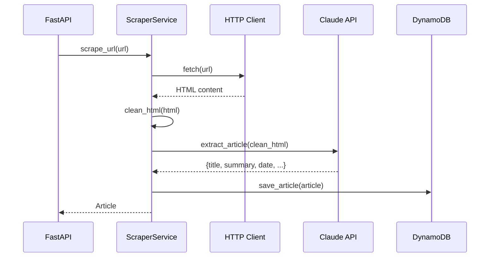

# Claude Web Scraping - Guía Técnica

Esta guía explica cómo usamos Claude SDK para extraer contenido de páginas web de noticias de forma inteligente.

## ¿Por qué Claude para Scraping?

| Approach Tradicional | Con Claude |
|---------------------|------------|
| Escribir selectores CSS específicos por sitio | Un solo prompt funciona para cualquier sitio |
| Rompe cuando el sitio cambia su HTML | Resistente a cambios de layout |
| No entiende contexto | Entiende qué es título, fecha, contenido |
| Requiere mantenimiento constante | Auto-adaptable |

## Arquitectura del Scraper



## Pipeline de Scraping

### 1. Fetch y Limpieza de HTML

```python
import httpx
from bs4 import BeautifulSoup

async def fetch_and_clean(url: str) -> str:
    """Descarga y limpia HTML para enviar a Claude."""
    async with httpx.AsyncClient() as client:
        response = await client.get(url, follow_redirects=True)
        response.raise_for_status()
    
    soup = BeautifulSoup(response.text, 'html.parser')
    
    # Eliminar elementos innecesarios
    for tag in soup(['script', 'style', 'nav', 'footer', 
                     'iframe', 'noscript', 'svg', 'img']):
        tag.decompose()
    
    # Extraer solo el contenido principal
    main = soup.find('main') or soup.find('article') or soup.body
    
    # Limitar a ~50k caracteres (límite práctico para Claude)
    return str(main)[:50000]
```

### 2. Extracción con Claude

```python
import anthropic
from pydantic import BaseModel

class ExtractedArticle(BaseModel):
    title: str
    summary: str
    published_date: str | None
    author: str | None
    main_image_url: str | None

async def extract_article(html: str, source_url: str) -> ExtractedArticle:
    """Usa Claude para extraer datos estructurados del HTML."""
    
    client = anthropic.Anthropic()
    
    response = client.messages.create(
        model="claude-sonnet-4-20250514",
        max_tokens=1024,
        messages=[{
            "role": "user",
            "content": f"""Analiza este HTML de una página de noticias y extrae:

1. **title**: El título principal del artículo
2. **summary**: Un resumen de 2-3 oraciones del contenido (máx 200 palabras)
3. **published_date**: Fecha de publicación en formato ISO (YYYY-MM-DD) o null
4. **author**: Nombre del autor o null si no está claro
5. **main_image_url**: URL de la imagen principal o null

URL fuente: {source_url}

HTML:
```html
{html}
```

Responde SOLO con JSON válido, sin markdown ni explicaciones:
{{"title": "...", "summary": "...", "published_date": "...", "author": "...", "main_image_url": "..."}}"""
        }]
    )
    
    # Parsear respuesta JSON
    import json
    data = json.loads(response.content[0].text)
    return ExtractedArticle(**data)
```

### 3. Manejo de Errores y Retries

```python
from tenacity import retry, stop_after_attempt, wait_exponential

@retry(
    stop=stop_after_attempt(3),
    wait=wait_exponential(multiplier=1, min=2, max=10)
)
async def safe_extract(url: str) -> ExtractedArticle | None:
    """Extracción con reintentos y manejo de errores."""
    try:
        html = await fetch_and_clean(url)
        return await extract_article(html, url)
    except httpx.HTTPError as e:
        logger.warning(f"HTTP error for {url}: {e}")
        return None
    except json.JSONDecodeError as e:
        logger.warning(f"Claude returned invalid JSON for {url}")
        return None
    except anthropic.APIError as e:
        logger.error(f"Claude API error: {e}")
        raise  # Retry on API errors
```

## Prompts Optimizados

### Para Páginas de Listado (Index/Home)

```python
LIST_EXTRACTION_PROMPT = """
Analiza este HTML de una página de listado de noticias.
Extrae TODOS los artículos visibles como una lista.

Para cada artículo extrae:
- title: Título del artículo
- url: URL del artículo (relativa o absoluta)
- snippet: Texto preview si existe

Responde con JSON: {"articles": [...]}
"""
```

### Para RSS/Atom Feeds

```python
RSS_EXTRACTION_PROMPT = """
Este es el contenido de un feed RSS/Atom.
Extrae los últimos 10 artículos con:
- title, link, published_date, description

Responde con JSON: {"articles": [...]}
"""
```

## Costos y Optimización

| Operación | Tokens aprox | Costo (Claude Sonnet) |
|-----------|-------------|----------------------|
| Extraer 1 artículo | ~2,000 input + 300 output | ~$0.008 |
| Extraer lista (10 items) | ~3,000 input + 500 output | ~$0.012 |

### Tips para Reducir Costos

1. **Cache agresivo**: Guardar artículos en DynamoDB con TTL de 24h
2. **HTML mínimo**: Limpiar bien el HTML antes de enviar
3. **Batch cuando posible**: Extraer múltiples URLs en una llamada
4. **Usar Haiku para validación**: Modelo más barato para checks simples

## Código Completo del Servicio

```python
# services/scraper_service.py
from dataclasses import dataclass
import anthropic
import httpx
from bs4 import BeautifulSoup

@dataclass
class ScraperConfig:
    max_html_chars: int = 50000
    model: str = "claude-sonnet-4-20250514"
    timeout_seconds: int = 30

class ScraperService:
    def __init__(self, config: ScraperConfig = ScraperConfig()):
        self.config = config
        self.client = anthropic.Anthropic()
        self.http = httpx.AsyncClient(timeout=config.timeout_seconds)
    
    async def scrape_article(self, url: str) -> ExtractedArticle:
        html = await self._fetch_clean_html(url)
        return await self._extract_with_claude(html, url)
    
    async def scrape_feed_page(self, url: str) -> list[dict]:
        html = await self._fetch_clean_html(url)
        return await self._extract_article_list(html, url)
    
    async def _fetch_clean_html(self, url: str) -> str:
        response = await self.http.get(url, follow_redirects=True)
        response.raise_for_status()
        
        soup = BeautifulSoup(response.text, 'html.parser')
        for tag in soup(['script', 'style', 'nav', 'footer']):
            tag.decompose()
        
        return str(soup)[:self.config.max_html_chars]
    
    async def _extract_with_claude(
        self, html: str, url: str
    ) -> ExtractedArticle:
        # ... implementation from above
        pass
```

## Testing del Scraper

```python
# tests/test_scraper.py
import pytest
from services.scraper_service import ScraperService

@pytest.mark.asyncio
async def test_scrape_techcrunch():
    scraper = ScraperService()
    article = await scraper.scrape_article(
        "https://techcrunch.com/2024/01/15/example-article/"
    )
    
    assert article.title is not None
    assert len(article.summary) > 50
    assert article.summary != article.title

@pytest.mark.asyncio  
async def test_scrape_handles_404():
    scraper = ScraperService()
    result = await scraper.safe_scrape("https://example.com/not-found")
    assert result is None
```
