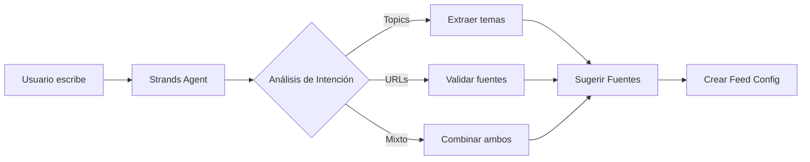
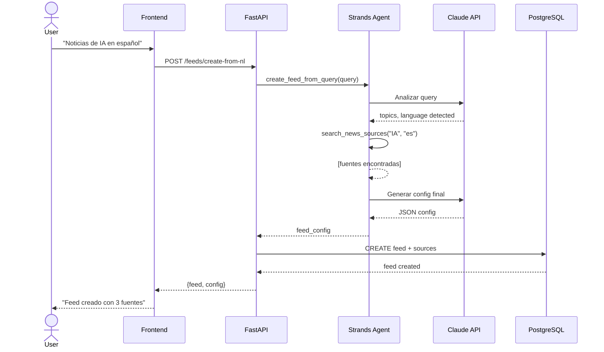

# Interpretación de Lenguaje Natural con Strands - Guía Técnica

Esta guía explica cómo el sistema interpreta las peticiones en lenguaje natural del usuario para crear feeds de noticias personalizados.

## Flujo de Interpretación



## ¿Qué es Strands?

Strands es un framework de Anthropic para crear agentes AI que pueden:
- Usar **herramientas** (tools) para ejecutar acciones
- Mantener **contexto** entre interacciones
- Tomar **decisiones** basadas en el input del usuario

## Arquitectura del Agente de Interpretación

```python
from strands import Agent
from strands.tools import tool

# Definimos las herramientas que el agente puede usar

@tool
def search_news_sources(
    topic: str, 
    language: str = "es",
    region: str | None = None
) -> list[dict]:
    """
    Busca fuentes de noticias relevantes para un tema específico.
    
    Args:
        topic: El tema a buscar (ej: "inteligencia artificial")
        language: Idioma preferido (es, en, etc)
        region: Región geográfica opcional (ej: "Argentina")
    
    Returns:
        Lista de fuentes con url, nombre, y score de relevancia
    """
    # En producción: buscar en una base de datos de fuentes conocidas
    # o usar una API de búsqueda
    sources_db = [
        {"url": "https://techcrunch.com", "name": "TechCrunch", "topics": ["tech", "startups", "ai"]},
        {"url": "https://wired.com", "name": "Wired", "topics": ["tech", "science", "ai"]},
        {"url": "https://infobae.com", "name": "Infobae", "topics": ["general", "argentina", "latam"]},
        # ... más fuentes
    ]
    
    # Filtrar por relevancia al topic
    return [s for s in sources_db if topic.lower() in " ".join(s["topics"])]


@tool
def validate_url(url: str) -> dict:
    """
    Valida si una URL es una fuente de noticias válida y accesible.
    
    Args:
        url: La URL a validar
    
    Returns:
        Dict con is_valid, site_name, feed_type (rss/website)
    """
    import httpx
    
    try:
        response = httpx.head(url, follow_redirects=True, timeout=10)
        is_valid = response.status_code == 200
        
        # Detectar si tiene RSS
        # ... lógica de detección
        
        return {
            "is_valid": is_valid,
            "site_name": extract_domain(url),
            "feed_type": "website"  # o "rss" si detectamos feed
        }
    except Exception:
        return {"is_valid": False, "error": "URL not accessible"}


@tool
def extract_topics_from_query(query: str) -> dict:
    """
    Extrae topics estructurados de una query en lenguaje natural.
    
    Esta herramienta usa el propio modelo para parsear el texto.
    
    Args:
        query: La petición del usuario en texto libre
    
    Returns:
        Dict con topics, language, region, urls_mentioned
    """
    # El agente mismo analizará esto con el modelo
    pass
```

## El Agente Completo

```python
from strands import Agent

class FeedCreationAgent(Agent):
    """
    Agente que interpreta peticiones en lenguaje natural para crear feeds.
    
    Ejemplos de input que puede manejar:
    - "Quiero noticias de IA y startups"
    - "Noticias de Argentina, preferiblemente de Infobae y La Nación"
    - "Tech news in English from TechCrunch and Ars Technica"
    - "https://example.com/rss.xml" (URL directa)
    """
    
    def __init__(self):
        super().__init__(
            model="claude-sonnet-4-20250514",
            tools=[
                search_news_sources,
                validate_url,
                extract_topics_from_query
            ],
            system_prompt=self._build_system_prompt()
        )
    
    def _build_system_prompt(self) -> str:
        return """Eres un asistente que ayuda a crear feeds de noticias personalizados.

Tu trabajo es:
1. Entender qué tipo de noticias quiere el usuario
2. Identificar topics, idiomas, regiones y URLs mencionadas
3. Sugerir fuentes relevantes si el usuario no especifica URLs
4. Crear una configuración de feed estructurada

IMPORTANTE:
- Si el usuario da URLs específicas, valídalas primero
- Si el usuario solo da topics, busca fuentes relevantes
- Siempre confirma el idioma preferido
- Sé proactivo sugiriendo fuentes relacionadas

Output esperado (JSON):
{
    "feed_name": "nombre descriptivo",
    "topics": ["topic1", "topic2"],
    "language": "es",
    "sources": [
        {"url": "...", "name": "...", "type": "rss|website"}
    ],
    "refresh_interval_minutes": 60
}
"""

    async def create_feed_from_query(self, user_query: str) -> dict:
        """Procesa una query del usuario y retorna configuración de feed."""
        
        response = await self.run(
            f"El usuario quiere crear un feed con esta descripción: {user_query}"
        )
        
        # El agente retornará un JSON con la configuración
        return self._parse_feed_config(response)
```

## Ejemplos de Interpretación

### Ejemplo 1: Query con Topics

**Input del usuario:**
```
"Quiero noticias de inteligencia artificial y machine learning en español"
```

**Proceso del agente:**
1. Extrae topics: `["inteligencia artificial", "machine learning"]`
2. Detecta idioma: `"es"`
3. Busca fuentes relevantes con `search_news_sources`
4. Genera configuración:

```json
{
    "feed_name": "IA y Machine Learning",
    "topics": ["inteligencia artificial", "machine learning"],
    "language": "es",
    "sources": [
        {"url": "https://hipertextual.com", "name": "Hipertextual", "type": "website"},
        {"url": "https://wwwhatsnew.com", "name": "Wwwhatsnew", "type": "rss"}
    ],
    "refresh_interval_minutes": 60
}
```

### Ejemplo 2: Query con URLs Específicas

**Input del usuario:**
```
"Quiero seguir TechCrunch y The Verge"
```

**Proceso del agente:**
1. Detecta nombres de sitios conocidos
2. Resuelve a URLs: `techcrunch.com`, `theverge.com`
3. Valida cada URL con `validate_url`
4. Genera configuración:

```json
{
    "feed_name": "Tech News (EN)",
    "topics": ["technology"],
    "language": "en",
    "sources": [
        {"url": "https://techcrunch.com", "name": "TechCrunch", "type": "website"},
        {"url": "https://theverge.com", "name": "The Verge", "type": "website"}
    ],
    "refresh_interval_minutes": 30
}
```

### Ejemplo 3: Query Mixta

**Input del usuario:**
```
"Noticias de startups en Argentina, incluí Infobae y algún otro medio tech"
```

**Proceso del agente:**
1. Extrae topics: `["startups"]`
2. Detecta región: `"Argentina"`
3. Detecta fuente específica: `Infobae`
4. Busca fuentes adicionales para "tech" + "argentina"
5. Genera configuración combinada

## Integración con el Backend

```python
# api/v1/feeds.py
from fastapi import APIRouter, Depends
from agents.feed_agent import FeedCreationAgent
from services.feed_service import FeedService

router = APIRouter()

@router.post("/feeds/create-from-nl")
async def create_feed_from_natural_language(
    query: str,
    user_id: str = Depends(get_current_user),
    agent: FeedCreationAgent = Depends(),
    feed_service: FeedService = Depends()
):
    """
    Crea un feed a partir de una descripción en lenguaje natural.
    
    Ejemplo: POST /feeds/create-from-nl
    Body: {"query": "Noticias de IA en español"}
    """
    # 1. El agente interpreta la query
    feed_config = await agent.create_feed_from_query(query)
    
    # 2. Creamos el feed en la base de datos
    feed = await feed_service.create_feed(
        user_id=user_id,
        name=feed_config["feed_name"],
        natural_language_query=query,  # Guardamos la query original
        sources=feed_config["sources"],
        refresh_interval=feed_config["refresh_interval_minutes"]
    )
    
    # 3. Disparamos el primer scraping
    await feed_service.trigger_scrape(feed.id)
    
    return {"feed": feed, "config": feed_config}
```

## Diagrama de Secuencia Completo



## Manejo de Ambigüedad

El agente está diseñado para manejar queries ambiguas:

| Query Ambigua | Cómo lo resuelve |
|---------------|------------------|
| "noticias" (muy genérico) | Pide clarificación sobre topics |
| "IA" sin idioma | Asume español si detecta contexto hispano |
| URL inválida | Informa el error y sugiere alternativas |
| Fuente desconocida | Intenta buscar o pide la URL completa |

```python
# Respuesta cuando hay ambigüedad
{
    "needs_clarification": true,
    "question": "¿Qué tipo de noticias te interesan más?",
    "suggestions": ["Tecnología", "Política", "Deportes", "Entretenimiento"]
}
```
